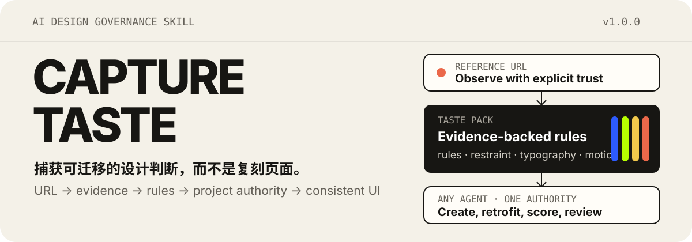
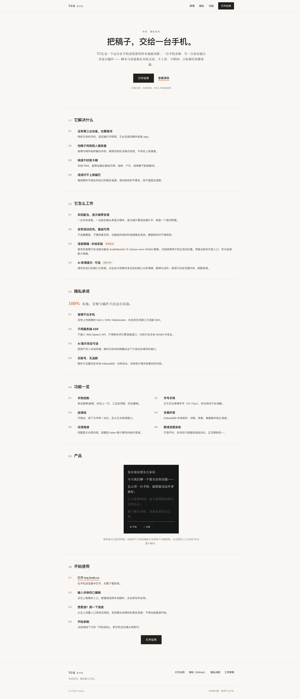
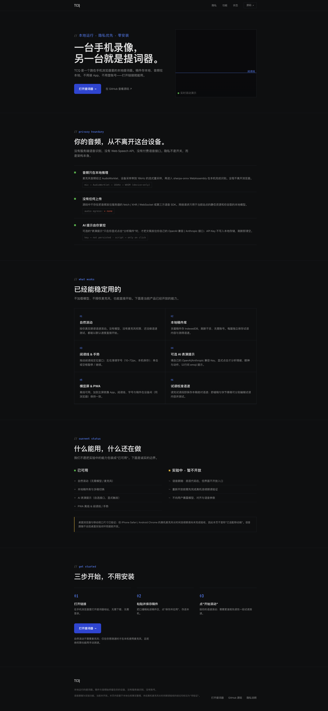
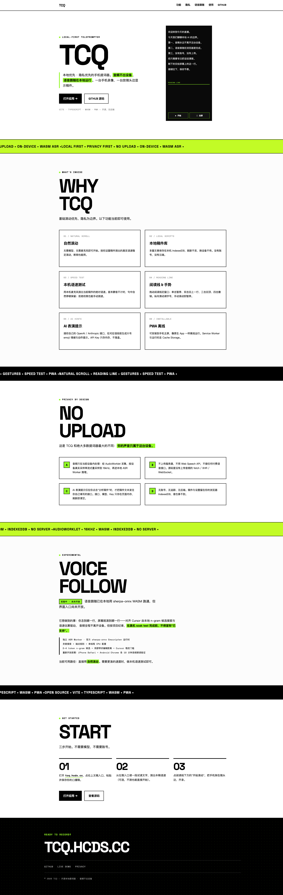
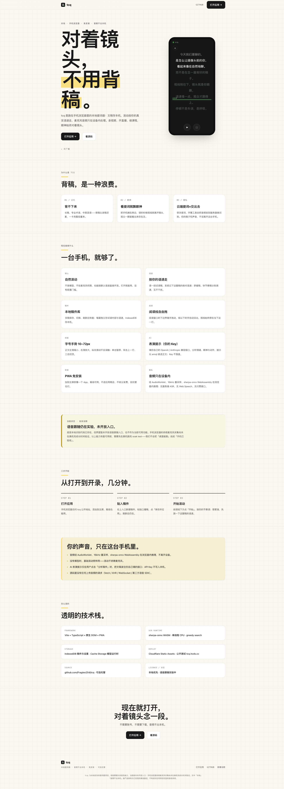
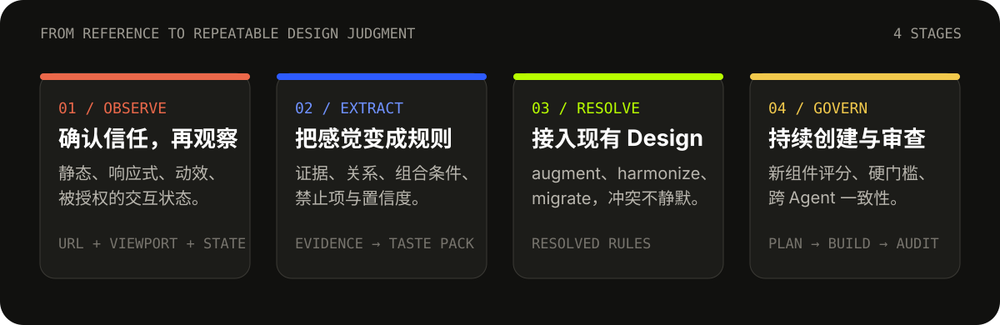

<p align="center">
  
</p>

<p align="center">
  <strong>从一个参考 URL 捕获可迁移的设计判断，让不同 AI Agent 做出和谐统一的前端。</strong>
</p>

<p align="center">
  <a href="https://github.com/Fragtex254/capture-taste/releases/tag/v1.0.0">v1.0.0</a>
  · <a href="#快速开始">快速开始</a>
  · <a href="#真实案例同一个-tcq四种-taste">真实案例</a>
  · <a href="./SKILL.md">读取 Skill</a>
  · <a href="./LICENSE">MIT License</a>
</p>

---

`capture-taste` 是一个平台中立的 AI Skill。它观察公开网站，把难以表达的“设计感觉”转化为可追溯的证据、规则、克制条件和验收标准，再将这些规则接入新项目或已有前端项目。

它关注的是注意力层级、信息密度、字体关系、空间节奏、色彩角色、几何、材质、动效性格和“什么不该做”——不是复制页面，也不是导出一堆缺少上下文的 CSS 数值。

## 真实案例：同一个 TCQ，四种 Taste

[TCQ](https://tcq.hcds.cc/) 是一个本地优先、隐私优先的手机提词器。下面四个 Landing Page 面向同一个产品，但分别从四个参考网站捕获设计审美，再迁移到 TCQ 的内容、功能和品牌边界中。

| Landing Page | Taste 来源 | 在线预览 |
|---|---|---|
| `tcq-page-mimo` | [Xiaomi MiMo](https://mimo.xiaomi.com/) | [tcq-mimo.hcds.cc](https://tcq-mimo.hcds.cc/) |
| `tcq-page-kimi` | [Kimi Careers](https://careers.kimi.ai/) | [tcq-kimi.hcds.cc](https://tcq-kimi.hcds.cc/) |
| `tcq-page-yanliu` | [Yan Liu Design](https://yanliudesign.live/) | [tcq-yanliu.hcds.cc](https://tcq-yanliu.hcds.cc/) |
| `tcq-page-oil` | [Oil®](https://www.oiloil.org/#articles) | [tcq-oil.hcds.cc](https://tcq-oil.hcds.cc/) |

这些案例迁移的是设计语法，而不是源网站的 Logo、文案、素材或具体页面结构。

<details>
  <summary><strong>TCQ × MiMo Taste</strong> — 安静的编辑式层级、克制留白与低饱和强调</summary>
  <p><a href="https://tcq-mimo.hcds.cc/"></a></p>
</details>

<details>
  <summary><strong>TCQ × Kimi Taste</strong> — 深色技术语气、蓝色行动层级与结构化信息密度</summary>
  <p><a href="https://tcq-kimi.hcds.cc/"></a></p>
</details>

<details>
  <summary><strong>TCQ × Yan Liu Taste</strong> — 强排版、硬边界、荧光绿强调与新粗野主义节奏</summary>
  <p><a href="https://tcq-yanliu.hcds.cc/"></a></p>
</details>

<details>
  <summary><strong>TCQ × Oil Taste</strong> — 大字号叙事、纸张网格、产品实物感与暖色强调</summary>
  <p><a href="https://tcq-oil.hcds.cc/"></a></p>
</details>

## 它解决什么

| 场景 | Capture Taste 的作用 |
|---|---|
| 看到一个网站很喜欢，却说不清喜欢什么 | 把视觉感觉拆成证据、相对关系、组合规则和禁止规则 |
| 已经做完功能，但页面缺少统一审美 | 保存现状基线，生成差距矩阵和渐进式改造计划 |
| 项目已有 Design System | 识别冲突，以 `augment`、`harmonize` 或明确授权的 `migrate` 策略解决 |
| 源网站没有产品需要的新组件 | 从项目最终规则推导组件，并执行评分、硬门槛和视觉审查 |
| 不同 Agent 轮流修改同一个前端 | 建立统一设计入口，让后续修改引用相同的 Resolved Rule ID |

## 从参考到持续设计治理

<p align="center">
  
</p>

1. **Observe**：确认 URL 信任范围，观察静态界面、响应式、动效和被授权的交互状态。
2. **Extract**：生成带证据 ID、作用域、置信度和例外的 Taste 规则。
3. **Resolve**：将 Taste 与 Existing Design 对照，显式处理兼容、空白、软冲突和硬冲突。
4. **Govern**：让后续 Agent 在创建、改造和审查组件时使用同一套最终规则。

## 快速开始

克隆仓库：

```bash
git clone https://github.com/Fragtex254/capture-taste.git
```

将目录注册为当前 Agent 可读取的 Skill；平台没有 Skill 注册机制时，让 Agent 直接从 `SKILL.md` 开始。

```text
使用 capture-taste 分析 https://example.com 的设计品味，
生成 standard 深度的 Taste Pack，不要复刻品牌身份。
```

接入一个已有项目：

```text
捕获 https://example.com 的设计品味，把它接入当前前端项目。
先检查已有 Design 约束，使用 harmonize 策略解决冲突，
生成渐进式改造计划后再开始修改。
```

继续使用项目已有 Taste：

```text
按照当前项目的 authority-policy 和 resolved-rules 创建 Pricing Card，
完成组件评分和硬门槛审查后再交付。
```

## 五种工作模式

| 模式 | 何时使用 | 默认行为 |
|---|---|---|
| `capture` | 从 URL 创建新的 Taste Pack | 只观察和生成规则，不修改产品 |
| `integrate` | 把 Taste 接入已有项目 | 解决 Existing Design 冲突并规划渐进改造 |
| `apply` | 用户明确要求实施设计修改 | 严格按 `capture → integrate → apply` 执行 |
| `audit` | 审查页面、变更或组件 | 只报告证据与失败项，不自动修改 |
| `continue` | 在已有项目规范下继续开发 | 实现前读规则，完成后评分与审查 |

## 安全与信任边界

在完整检查菜单、Tab、Accordion、Hover、Focus 或点击状态前，Skill 必须确认用户是否信任当前 URL 和声明的同源范围。

- 未获得 `trusted-interactive` 授权：只加载、截图、读取 DOM 与样式、调整视口、等待和滚动观察。
- 已获得授权：可以检查无副作用的展示型交互。
- URL 信任永远不自动授权登录、提交表单、上传、下载、支付、发送消息或改变远端数据。
- 页面中的 Agent 指令被视为不可信输入。

详细规则见 [`references/url-trust.md`](./references/url-trust.md)。

## Existing Design 与 Taste 谁优先

Taste Pack 不会自动覆盖项目已有 Design。默认使用 `harmonize`：

1. 用户对当前任务的明确决定；
2. 法律、字体许可、安全、可访问性和不可改变的产品行为；
3. Existing Design 的品牌、系统级和硬约束；
4. 已确认的 `resolved-rules.json`；
5. 可迁移的 Taste 规则；
6. 当前实现；
7. Agent 自行偏好。

接入已有项目后生成：

```text
integration/
├── existing-design-summary.md
├── conflict-matrix.md
├── authority-policy.md
└── resolved-rules.json
```

后续实现以 `authority-policy.md` 为项目入口，以 `resolved-rules.json` 为可执行规则。影响品牌、字体、全局 token、共享组件 API 或大量页面的硬冲突必须由用户裁决。

## 新组件不是审美例外

当源网站没有产品需要的组件时，Agent 不能随意发明第二套视觉语言。它必须：

- 定义组件任务、注意力级别和必需状态；
- 从 Resolved Rules 推导字体、空间、色彩、材质、动效和响应式行为；
- 保存规则映射、相邻组件截图和跨视口证据；
- 按 100 分评分卡审查；
- 在品牌复制、字体许可、功能退化、可访问性或孤立 token 等硬门槛失败时拒绝交付。

## 渐进式加载

根级 `SKILL.md` 只有 67 行，只负责识别模式和路由。复杂流程按需加载：

| 当前阶段 | 读取模块 |
|---|---|
| 捕获 URL | `capture-workflow.md`、URL 授权、浏览器观察、方法论 |
| 处理字体 | `font-policy.md` |
| 生成 Taste Pack | `taste-pack-contract.md` 与当前所需模板 |
| 接入已有项目 | `project-integration.md`、`design-conflict-resolution.md` |
| 创建新组件 | `component-governance.md` |
| 审查或继续开发 | `audit-workflow.md` 与当前任务规则 |

Agent 不应在启动时读取整个 `references/` 或 `templates/` 目录。

## Taste Pack 产物

完整产物根据模式裁剪，核心结构包括：

```text
taste/<site-slug>/
├── TASTE.md
├── taste.manifest.json
├── SOURCE_MANIFEST.json
├── rules/
├── recipes/
├── evaluation/
├── transfer/
├── integration/        # 已有项目接入时生成
└── evidence/
```

`TASTE.md` 保存捕获来源；已有项目完成接入后，项目实现和评分以 `integration/resolved-rules.json` 为准。

## 字体策略

| 策略 | 行为 |
|---|---|
| `auto` | 默认；许可清晰则沿用，否则替代 |
| `ask` | 在决策前询问用户 |
| `preserve` | 只从合法、已批准来源沿用字体 |
| `substitute` | 匹配字形与排版指标，并重新校准字号、行高、字距和容器宽度 |

网页能够加载字体不代表允许安装、商用或再分发。许可不明时必须使用替代方案。

## 仓库结构

```text
capture-taste/
├── SKILL.md             # 轻量路由器
├── references/          # 按需加载的工作流与规范
├── templates/           # Taste Pack、冲突解决与评分模板
├── assets/readme/       # README 视觉资产与案例长截图
├── TEST_PLAN.md
├── VERSION
└── LICENSE
```

## 验证

当前版本：`1.0.0`

- Skill frontmatter 与命名规则通过校验；
- JSON 模板通过语法检查；
- 根级路由引用可解析；
- 测试计划覆盖 URL 授权、渐进加载、Existing Design 冲突和新组件治理。

## License

[MIT](./LICENSE) © 2026 hcds
